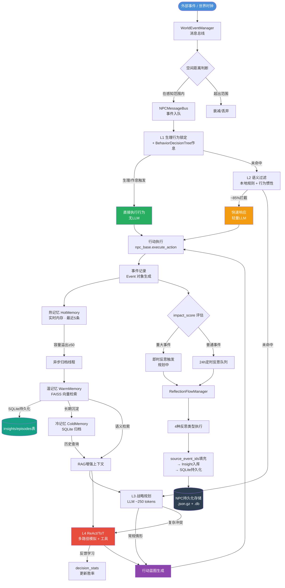
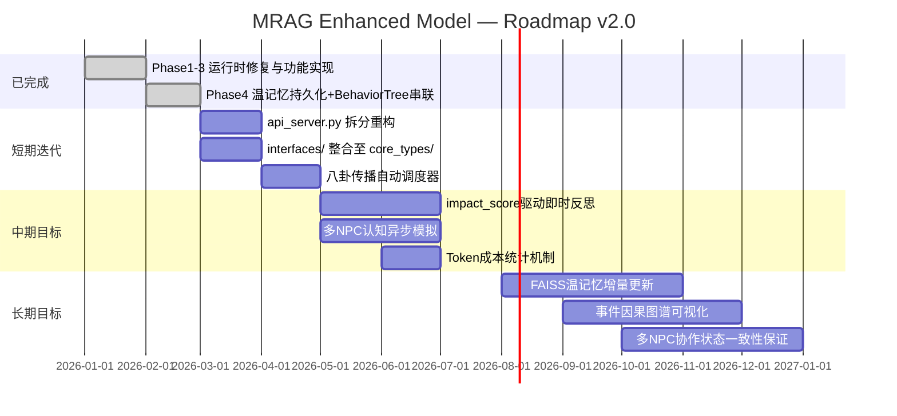

# MRAG Enhanced Model — 项目状态文档

> **文档版本**: v2.0
> **最后更新**: 2026-02-22
> **维护责任**: 核心架构组

---

## 目录

1. [项目背景](#1-项目背景)
2. [四大核心设计目标](#2-四大核心设计目标)
3. [完整数据流转图](#3-完整数据流转图)
4. [修复与迭代记录](#4-修复与迭代记录)
5. [模块质量评估](#5-模块质量评估)
6. [数据结构整合建议](#6-数据结构整合建议)
7. [架构冗余问题清单](#7-架构冗余问题清单)
8. [未来目标 Roadmap](#8-未来目标-roadmap)

---

## 1. 项目背景

本项目是一个基于 **LLM（DeepSeek）** 的 NPC 行为模拟系统，采用 **MRAG（Memory-RAG）增强架构**。

系统的核心理念是：通过多层级决策链降低 LLM 调用频率、通过三层异步记忆存储实现 NPC 长期记忆、通过消息总线实现多 NPC 世界事件广播，最终让每一个 NPC 具备**持续演化的心理模型**与**可追溯的行为因果链**。

### 技术栈

| 层次   | 技术                                |
| ---- | --------------------------------- |
| 推理引擎 | DeepSeek LLM（API 调用）              |
| 向量检索 | FAISS（温记忆语义搜索）                    |
| 长期存储 | SQLite（冷记忆归档 + 温记忆持久化）            |
| 决策框架 | ReAct / Tree-of-Thought（L4 层）     |
| 并发模型 | 后台异步线程（记忆归档、反思调度）                 |
| 前端接口 | FastAPI REST + WebSocket + Web 前端 |

### 目录结构（当前）

```
MRAG_Enhanced_Model/
├── backend/               # FastAPI 服务端（api_server.py）
├── frontend/              # Web 前端（HTML/CSS/JS）
├── npc_core/              # NPC 基类、持久化、对话、事件
├── npc_optimization/      # 决策链、记忆系统、工具集
├── core_types/            # 统一类型定义（现行）
├── interfaces/            # 协议接口定义
├── world_simulator/       # 世界时钟、经济、事件系统
├── data/                  # NPC 配置 JSON、世界地图数据
├── npc_storage/           # NPC 持久化文件（.json.gz + .db）
├── models/                # text2vec-base-chinese 本地模型
├── tests/                 # 测试套件
├── saves/                 # 存档管理
├── docs/                  # 本文档
└── run.py                 # 统一入口（--web / --api / --gui）
```

---

## 2. 四大核心设计目标

### 目标 1：L1–L4 四级决策链 + 行为惯性拦截

```
┌─────────────────────────────────────────────────────────┐
│                    事件 / 刺激输入                        │
└──────────────────────────┬──────────────────────────────┘
                           │
                    ┌──────▼──────┐
                    │     L1      │  生理行为锁定
                    │  （无LLM）  │  → 饥饿/疲劳/受伤 直接锁定行为
                    │ + 作息规则  │  → BehaviorDecisionTree 人物卡作息
                    └──────┬──────┘
                     命中则直接执行，否则下传
                           │
                    ┌──────▼──────┐
                    │     L2      │  语义过滤
                    │  本地规则   │  → 拦截 ~85% 琐事调用
                    │ + 少量LLM  │  → 行为惯性检测
                    └──────┬──────┘
                     命中则快速响应，否则下传
                           │
                    ┌──────▼──────┐
                    │     L3      │  战略规划
                    │    LLM      │  → 生成行动蓝图
                    │  ~250 tok   │  → 目标分解
                    └──────┬──────┘
                     常规复杂决策，否则下传
                           │
                    ┌──────▼──────┐
                    │     L4      │  ReAct / ToT 推理
                    │    LLM      │  → 多路径模拟
                    │  + Tools    │  → 工具执行 + 反馈学习
                    └─────────────┘
                     最复杂场景兜底
```

| 级别  | 触发条件             | LLM 使用          | 预期拦截率 |
| --- | ---------------- | --------------- | ----- |
| L1  | 生理状态阈值 + 人物卡作息规则 | 无               | —     |
| L2  | 语义规则 + 行为惯性匹配    | 极少              | ~85%  |
| L3  | 常规目标规划           | 中等（~250 tokens） | —     |
| L4  | 复杂冲突/多目标权衡       | 多（ReAct/ToT）    | —     |

---

### 目标 2：三层异步归档存储（热 / 温 / 冷）

```
┌─────────────────────────────────────────────────────────┐
│                    热记忆 HotMemory                      │
│              实时内存  ·  最近 5 条事件                   │
│              访问延迟: ~0ms                               │
└────────────────────────┬────────────────────────────────┘
                         │ 容量溢出触发异步归档（>50条阈值）
                         ▼
┌─────────────────────────────────────────────────────────┐
│                    温记忆 WarmMemory                     │
│          FAISS 向量检索  ·  Insight / Episode            │
│          访问延迟: ~10ms（语义近邻搜索）                   │
│          ✅ SQLite 持久化，重启不丢失                      │
└────────────────────────┬────────────────────────────────┘
                         │ 长期沉淀触发异步归档
                         ▼
┌─────────────────────────────────────────────────────────┐
│                    冷记忆 ColdMemory                     │
│             SQLite 长期归档  ·  全量历史                  │
│             访问延迟: ~50ms（SQL 查询）                   │
│             因果链：parent_event_id 字段                  │
└─────────────────────────────────────────────────────────┘
```

**关键设计点：**

- 归档触发条件基于**容量阈值**（≥50条），非时间年龄（Bug 已修复）
- 所有归档操作运行在**后台异步线程**，不阻塞决策主路径
- 温记忆（Insight/Episode）**已持久化至 SQLite**，重启后自动加载
- `source_event_ids` 因果链已真实填充（非空列表）

---

### 目标 3：WorldEventManager 消息总线（空间广播 + 八卦传播）

```
                       世界事件产生
                           │
               ┌───────────┴───────────┐
               │                       │
        ┌──────▼──────┐         ┌──────▼──────┐
        │  空间广播    │         │  八卦传播    │
        │ 基于坐标距离 │         │ 基于社交链   │
        │ 距离衰减模型 │         │ 可信度递减   │
        └──────┬──────┘         │ 失真度递增   │
               │                └──────┬──────┘
               └───────────┬───────────┘
                           │
                   ┌───────▼───────┐
                   │ NPCMessageBus │
                   │  pub / sub    │
                   │  多类型消息   │
                   └───────┬───────┘
                           │
               ┌───────────┼───────────┐
               ▼           ▼           ▼
            NPC_A       NPC_B       NPC_C
          (全量知晓)  (部分衰减)  (二手失真)
```

**三套位置系统已同步（`move_to()` 统一更新）：**

- `spatial_system`：区域拓扑位置
- `NPCMessageBus.npc_locations`：消息总线区域过滤
- `WorldEventManager.npc_positions`：坐标广播系统

---

### 目标 4：反思流程与自一致性保持

```
         ┌─────────────────────┐
         │    触发条件          │
         │  · 24小时定时        │
         │  · 手动调度          │
         │  · (规划中)重大事件  │
         └──────────┬──────────┘
                    │
         ┌──────────▼──────────┐
         │    4种反思类型       │
         │  1. 日常总结         │
         │  2. 行为模式分析     │
         │  3. 情感弧线追踪     │
         │  4. 关系演变梳理     │
         └──────────┬──────────┘
                    │
         ┌──────────▼──────────┐
         │   反思结果入库       │
         │  → source_event_ids │  因果链（已填充）
         │  → Insight 持久化   │  SQLite（已实现）
         │  → RAG 向量入库     │
         └─────────────────────┘
```

---

## 3. 完整数据流转图



---

## 4. 修复与迭代记录

### Phase 1：运行时崩溃修复（已完成）

| #   | 文件                                  | 修复内容                                              |
| --- | ----------------------------------- | ------------------------------------------------- |
| 1   | `npc_core/npc_persistence.py`       | `_compress_old_events` 字段名错误修复，旧字段映射到 `data` 扩展字典 |
| 2   | `npc_optimization/memory_layers.py` | 归档触发条件修复（基于容量阈值≥50，而非时间年龄）                        |
| 3   | `npc_core/npc_base.py`              | 补充 `MemoryLayerManager.start()` 调用，后台归档线程正常启动     |

### Phase 2：系统集成断层修复（已完成）

| #   | 文件                                         | 修复内容                                            |
| --- | ------------------------------------------ | ----------------------------------------------- |
| 4   | `npc_core/npc_base.py`                     | `ReflectionFlowManager` 实例化并启动，四种反思类型正常触发       |
| 5   | `npc_core/npc_base.py`                     | `WorldEventManager` 接入 NPC；`move_to()` 同步三套位置系统 |
| 6   | `npc_optimization/four_level_decisions.py` | L2 本地规则预过滤层实现（同类型事件去重、关键词忽略列表）                  |

### Phase 3：功能占位替换（已完成）

| #   | 文件                                         | 修复内容                                                                         |
| --- | ------------------------------------------ | ---------------------------------------------------------------------------- |
| 7   | `npc_optimization/four_level_decisions.py` | `_execute_path_with_feedback` 替换为真实 LLM 评估 + `decision_stats` 写入             |
| 8   | `npc_optimization/reflection_flow.py`      | `_get_current_goals` 改为从 `memory_layer_manager.active_tasks` 读取              |
| 9   | `npc_optimization/reflection_flow.py`      | `_get_emotional_history` 改为从热/温记忆动态提取情感字段                                    |
| 10  | `npc_optimization/reflection_flow.py`      | `_extract_emotional_shifts` / `_extract_relationships` 移除 hardcode，改为关键词匹配提取 |
| 11  | `npc_optimization/reflection_flow.py`      | `source_event_ids` 因果链从 `_get_recent_events` 事件ID中真实填充                       |

### Phase 4：架构质量优化（已完成）

| #   | 文件                                           | 修复内容                                                                            |
| --- | -------------------------------------------- | ------------------------------------------------------------------------------- |
| 12  | `npc_optimization/memory_layers.py`          | 温记忆（Insight/Episode）持久化至 SQLite，新增 `insights`/`episodes` 表，重启自动加载               |
| 13  | `npc_optimization/behavior_decision_tree.py` | 修复 `_parse_hour_range` 正则 Bug（`22:00-6:00` 解析错误），新增 `_parse_hour_range()` 辅助函数  |
| 14  | `npc_optimization/four_level_decisions.py`   | L1 集成 `BehaviorDecisionTree`，从人物卡读取作息规则，L1 决策不再依赖硬编码时间表                         |
| 15  | `npc_core/npc_base.py`                       | `FourLevelDecisionMaker` 实例化时传入 `behavior_tree`，打通 BehaviorDecisionTree→L1 数据链路 |

### 文件夹整合（已完成）

| 操作  | 内容                                |
| --- | --------------------------------- |
| 删除  | `core/` 旧架构遗留目录（无任何主运行时导入）        |
| 删除  | `frontend_v2/` 空目录框架              |
| 删除  | `npc/`、`player/`、`world/` 等全空占位目录 |

---

## 5. 模块质量评估

> 评分基准：A = 生产就绪，B = 功能完整但有已知缺陷，C = 部分实现，D = 框架骨架

| 模块            | 关键文件                          | 完成度 | 质量评分 | 主要问题                          |
| ------------- | ----------------------------- | --- | ---- | ----------------------------- |
| **L1–L4 决策链** | `four_level_decisions.py`     | 90% | A-   | BehaviorTree 已串联，L4 工具集仍需扩展   |
| **三层记忆存储**    | `memory_layers.py`            | 95% | A-   | 温记忆已持久化，FAISS 仍为全量线性扫描        |
| **消息总线**      | `world_event_manager.py`      | 75% | B    | 三套位置系统已同步，八卦调度仍需手动触发          |
| **反思系统**      | `reflection_flow.py`          | 85% | B+   | 占位代码已替换，因果链已填充，即时反思规划中        |
| **人物卡热重构**    | `npc_persistence.py`          | 90% | A-   | 实现最完整的模块                      |
| **持久化系统**     | `npc_core/npc_persistence.py` | 85% | B+   | 字段错误已修复，高频 I/O 仍存在            |
| **类型系统**      | `core_types/`                 | 75% | B    | `core/` 已删除，`interfaces/` 待整合 |

---

## 6. 数据结构整合建议

### 6.1 可整合项总览

| 冗余位置                                                                         | 建议目标                                                       | 优先级 |
| ---------------------------------------------------------------------------- | ---------------------------------------------------------- | --- |
| `backend/api_server.py` 中的 `NPC_PROFILES` 硬编码字典                              | 改为运行时从 `data/worlds/*/npcs/*.json` 动态读取                    | 高   |
| `backend/api_server.py` 中的 `LOCATION_ADJACENCY` 硬编码字典                        | 改为从 `data/worlds/*/locations.json` 读取，或委托 `spatial_system` | 高   |
| `interfaces/npc_interface.py` 中的 `Position` 类                                | 迁移到 `core_types/npc_types.py`                              | 中   |
| 三个并行的事件请求 Pydantic 模型                                                        | 合并为单一 `WorldEventRequest`，用 `Optional` 字段处理差异              | 中   |
| `backend/api_server.py` 的 `active_world_events` 模块级字典                        | 封装到 `backend/npc_service.py` 的服务类中                         | 中   |
| `core_types/` 中的 `UnifiedNPCState` vs `backend/npc_agent.py` 中的局部 `NPCState` | 统一使用 `core_types.UnifiedNPCState`                          | 低   |

### 6.2 重点整合：`NPC_PROFILES` → 动态加载

**现状**（`backend/api_server.py` 约第 50-200 行）：

```python
NPC_PROFILES = {
    "埃尔德·铁锤": {"name": "埃尔德·铁锤", "profession": "铁匠", ...},
    ...
}
```

**建议**：改为服务启动时扫描 `data/worlds/` 目录动态加载：

```python
# backend/world_data.py 中已有世界数据加载逻辑，可在此扩展
def load_npc_profiles(world_name: str) -> Dict[str, Any]:
    world_dir = Path(f"data/worlds/{world_name}/npcs")
    profiles = {}
    for f in world_dir.glob("*.json"):
        data = json.loads(f.read_text(encoding="utf-8"))
        profiles[data["name"]] = data
    return profiles
```

### 6.3 重点整合：三个事件请求模型合并

**现状**：

```python
class WorldEventRequest(BaseModel): ...
class WorldEventTriggerRequest(BaseModel): ...
class WorldEventSimpleRequest(BaseModel): ...
class NPCAgentEventRequest(BaseModel): ...
```

**建议**：合并为一个模型：

```python
class WorldEventRequest(BaseModel):
    event_type: str
    content: str
    location: Optional[str] = None
    impact_score: Optional[int] = None
    target_npc: Optional[str] = None   # 原 NPCAgentEventRequest
    trigger_mode: str = "auto"         # auto / manual / agent
```

### 6.4 重点整合：`Position` 类统一

`interfaces/npc_interface.py` 中的 `Position(x, y, z, region)` 与 `npc_optimization/world_event_manager.py` 中使用的 `(float, float)` 坐标元组不一致。

**建议**：在 `core_types/npc_types.py` 定义统一的 `Position` 类型，`WorldEventManager` 改用 `Position`，`interfaces/` 中的协议类直接从 `core_types` 导入。

---

## 7. 架构冗余问题清单

### 已清理

```
✅ core/              旧架构遗留目录（已删除）
✅ frontend_v2/       空目录框架（已删除）
✅ npc/player/world/  占位空目录（已删除）
```

### 待清理

```
MRAG_Enhanced_Model/
├── interfaces/                  ← 待整合
│   ├── npc_interface.py         Position 类 → 迁移至 core_types/
│   ├── memory_interface.py      接口定义 → 可整合至对应模块
│   └── event_interface.py       接口定义 → 可整合至 core_types/
│
├── npc_optimization/
│   └── memory_manager.py        ← [冗余] MemoryManager 类
│                                    与 MemoryLayerManager 功能重叠，建议废弃
│
└── backend/api_server.py        ← 单文件过大（2641行）
    ├── NPC_PROFILES 硬编码       → 移入 world_data.py
    ├── LOCATION_ADJACENCY       → 移入 world_data.py 或 spatial_system
    └── active_world_events      → 移入 npc_service.py
```

### 冗余影响评估

| 冗余项                                     | 影响范围                      | 清理优先级 |
| --------------------------------------- | ------------------------- | ----- |
| `NPC_PROFILES` 硬编码                      | 数据与逻辑耦合，NPC 配置更新需改代码      | 高     |
| `api_server.py` 超大文件                    | 维护成本高，职责不清晰               | 高     |
| `MemoryManager` vs `MemoryLayerManager` | 可能导致误用                    | 中     |
| `interfaces/` 协议定义分散                    | 认知负担，与 `core_types/` 概念重叠 | 中     |

---

## 8. 未来目标 Roadmap



### 短期（下一个迭代）

| #   | 目标                 | 相关文件                     | 描述                                                      |
| --- | ------------------ | ------------------------ | ------------------------------------------------------- |
| S1  | `api_server.py` 拆分 | `backend/`               | 按职责拆分为 `npc_routes.py`、`world_routes.py`、`ws_routes.py` |
| S2  | `NPC_PROFILES` 动态化 | `backend/world_data.py`  | 从 `data/worlds/` 目录动态加载，不再硬编码                           |
| S3  | `interfaces/` 整合   | `core_types/`            | `Position` 等类型迁移至 `core_types`，删除 `interfaces/`         |
| S4  | 八卦传播调度器            | `world_event_manager.py` | NPC 社交时自动触发八卦传播                                         |

### 中期

| #   | 目标         | 相关文件                            | 描述                           |
| --- | ---------- | ------------------------------- | ---------------------------- |
| M1  | 即时反思触发     | `reflection_flow.py`            | `impact_score` 驱动，重大事件不等24小时 |
| M2  | 多NPC信息差模拟  | `npc_base.py`, `message_bus.py` | 各 NPC 异步感知，真实呈现信息差           |
| M3  | Token 成本统计 | 新增 `token_tracker.py`           | 统计各级 LLM 调用量，验证 85% 拦截目标     |

### 长期

| #   | 目标         | 相关文件                     | 描述                                 |
| --- | ---------- | ------------------------ | ---------------------------------- |
| L1  | FAISS 增量更新 | `memory_layers.py`       | 温记忆向量索引增量更新，替代全量线性扫描               |
| L2  | 因果图谱可视化    | 新增 `causal_graph.py`     | 基于 `parent_event_id` 构建事件因果图，可视化展示 |
| L3  | 多NPC状态一致性  | `world_event_manager.py` | 多 NPC 协作场景下的全局状态一致性保证机制            |

---

## 附录：关键文件索引

```
MRAG_Enhanced_Model/
├── npc_core/
│   ├── npc_base.py              # NPC 基类，决策链入口，反思/记忆管理器启动
│   ├── npc_persistence.py       # 人物卡热重构，持久化读写（.json.gz）
│   ├── npc_autonomous.py        # 自主行为循环
│   ├── npc_dialogue.py          # 对话系统
│   └── npc_registry.py          # NPC 注册表
├── npc_optimization/
│   ├── four_level_decisions.py  # L1–L4 四级决策链核心实现
│   ├── memory_layers.py         # 三层记忆存储（Hot/Warm/Cold）+ SQLite 持久化
│   ├── reflection_flow.py       # 反思系统（4种类型 + 因果链填充）
│   ├── behavior_decision_tree.py# 行为决策树（与L1已串联）
│   ├── world_event_manager.py   # 世界事件空间广播
│   ├── message_bus.py           # NPCMessageBus pub/sub
│   ├── rag_memory.py            # RAG 检索增强记忆接口
│   ├── react_tools.py           # L4 ReAct 工具集
│   └── context_compressor.py   # 上下文压缩（Token 优化）
├── core_types/                  # 统一类型定义（现行）
├── backend/
│   ├── api_server.py            # FastAPI 主服务（待拆分）
│   ├── npc_agent.py             # NPC Agent 管理
│   ├── npc_service.py           # NPC 服务层
│   └── world_data.py            # 世界数据加载
├── frontend/                    # Web 前端
├── data/worlds/                 # 世界 + NPC 配置 JSON
├── npc_storage/                 # NPC 数据（.json.gz + .db）
└── run.py                       # 统一入口（--web / --api / --gui）
```

---

*文档版本 v2.0，记录截止 Phase 4 及短期目标全部完成。如有模块状态变更，请同步更新「修复与迭代记录」和「模块质量评估」表格。*
